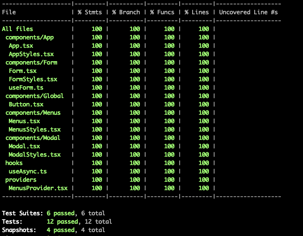

# Code test

## Overview

https://coding-billyi.github.io/nested-menu/

- [React.js](https://reactjs.org/)
- [Emotion.js](https://emotion.sh/docs/introduction)
- [Jest](https://jestjs.io/)
- [Testing Library](https://testing-library.com/)
- [Typescript](https://www.typescriptlang.org/)

## Getting Started

### Prerequisites

- Git
- Node: 14.16.0 or greater
- NPM: 6.14.0 or greater

### Installation

1. `yarn prepare` to install [husky](https://typicode.github.io/husky/#/)
2. `yarn install` to install the website's npm dependencies

### Running locally

1. `yarn start` to start the hot-reloading development server and run jest test in watch mode
2. open http://localhost:8080 to open the site in your favorite browser

- Tool: Webpack, Webpack Dev Server, Jest

## Running the tests

### Lint

`yarn format` to format the code automatically. The format command will be triggered by [husky](https://typicode.github.io/husky/#/) at pre-commit phase

- Tool: ESLint, Prettier

### Test

`yarn test` to run unit test & integration test

- Tool: Jest, @testing-library/react , @testing-library/react-hooks, [msw](https://mswjs.io/)

Jest Test Coverage: 100%

##### Issues

- @testing-library/user-event userEvent.type() issues with dynamic form field testing for controlled form state update
- @testing-library/react screen.getByRole('menu', { name:/laundry/i }) not work
